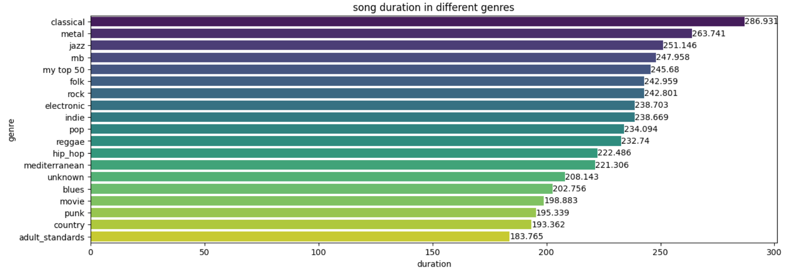

# Spotify Data Analysis Project

This project involves collecting and analyzing data from Spotify using the Spotify API and combining it with additional datasets to create a comprehensive music database. My goal was to practice my skills in data preparation and analysis using Python. I learned to use Spotify's API and the Spotipy library from the documentation, with help from YouTube and various AI chats like ChatGPT and Claude.  
This file contains my analysis report  
if you want to see how I created the datasets and prepard the data you can read the main [`README.md`](README.md) file.  
**To see the complete report including the code for the analysis in jupyter notebook click [here]() to go to nbviewer**  
## Table of Contents   
  - [how many songs were realesd each year](#how-many-songs-were-realesd-each-year)  
  - [the explicit coloumn](#the-explicit-coloumn)  
    + [Songs with Parental Advisory over the years](#Songs-with-Parental-Advisory-over-the-years)
    + [effect of explicit content on the popularity of the song](#effect-of-explicit-content-on-the-popularity-of-the-song)
      * [Understanding the Data](#Understanding-the-Data)
      * [avg popularity and distribution of popularity Values](#avg-popularity-and-distribution-of-popularity-Values)
      * [Mean Popularity by Explicit Status Over release year](#Mean-Popularity-by-Explicit-Status-Over-release-year)
     + [conclusion](#conclusion)
     + [correlation map](#correlation-map)
       * [popularity, explicit and danceability](#popularity,-explicit-and-danceability)
     + [more fun insights](#more-fun-insights)
  - [my personal taste](#my-personal-taste)

## Key Features

- Data collection using Spotify's API to fetch song attributes.
- Exploratory data analysis to understand the relationships between different song attributes and popularity.
- Visualization of data using libraries such as Matplotlib and Plotly.
- Analysis of the impact of explicit content on song popularity, considering other audio features.

## Requirements

- Python 3.x
- Jupyter Notebook
- Libraries: pandas, numpy, matplotlib, plotly, seaborn, scipy.
# Analysis

## how many songs were realesd each year
note that this is effected by the way the dataset was created. for exemple you can see that the drop after 2020 is because the  dateset I found online is only up to april 2021 and my dataset is around 250 songs from each year between 1950-2024.

you can say that the number of songs every year has been increasing overall in this dataset.

[Back to Top](#Table-of-Contents)

## the explicit coloumn
Certain songs have parental advisory label associated with them indicating the song contains adult content which may not be suitable for children. Let's see how many songs in the dataset have advisory label associated with them through the years.

we will compre precentege of songs with explicit labal out of the total number of songs realesd that year

### Songs with Parental Advisory over the years

Since the percentage of songs with explicit content each year seems to be rising, I wonder if they are also more popular.

[Back to Top](#Table-of-Contents)

### effect of explicit content on the popularity of the song

#### Understanding the Data:

From Spotify's documentation: 

"The popularity of a track is a value between 0 and 100, with 100 being the most popular. The popularity is calculated by an algorithm and is based, for the most part, on the total number of plays the track has had and how recent those plays are. Generally speaking, songs that are being played a lot now will have a higher popularity than songs that were played a lot in the past."

This means that the release year will probably affect the popularity of a song since a new song with a lot of streams now will have a higher score than an old song that had more streams years ago but is now forgotten. In other words, popularity is not an "all-time popularity" or "total number of streams" but the current popularity of the song. Since most of our data is from 2021, it reflects the 2021 popularity score.

[Back to Top](#Table-of-Contents)

#### avg popularity and distribution of popularity Values

mean_popularity = 29.735

[Back to Top](#Table-of-Contents)

#### explicit vs non-explicit

**avg popularity and distribution of popularity Values**  
let's calculate the mean on the explicit songs and the non explicit songs

Mean for explicit: 47.371  
Mean for non-explicit: 28.732

The mean popularity of explicit songs seems to be higher.  
Note that there are many more non-explicit songs in the database than explicit ones, which might affect the result.

to check if I can compre the means I created a graph of the distribution of popularity Values in explicit songs and non explicit songs.

We can see that the explicit songs have a normal distribution of popularity, suggesting that it should be okay to compare the mean values even if there is much less data.

Since there were no explicit songs in the early years, I think it makes sense to compare the average popularity only from around when they appeared.

Additionally, there are a lot of songs with a score of 0 in the database. I don’t think they are relevant because they are songs with no exposure at all, so I can’t determine if the explicit label affects popularity from them.

from now on I will work with a data frame where the release year will be bigger than 1964 and the popularity will be higher than 0.

Mean for explicit: 47.371  
Mean for non-explicit: 28.732

The average popularity score of explicit songs is still higher, which may suggest that songs with explicit content were more popular and received more streams in 2021.

I asked an AI to help me compare two data sets with a big difference in sample sizes. I will try to understand those tests and concepts later.

Bootstrapping is the only method I currently understand. It involves repeatedly comparing equal-sized samples from both groups, getting the average of those sample groups, comparing them, and then taking the average of all the results to find the mean difference.

**Welch's t-test -  
t-statistic:** 134.8502,**p-value:** 0.0000  

**Mann-Whitney U test -**  
 **U-statistic:** 6429981500.5000, **p-value:** 0.0000

**Bootstrap -**  
 **Mean difference:** 15.1908,  
 **95% CI:** (14.5531, 15.8492)

**Visualization:**

It seems like there is a connection between explicit content and the popularity of a song.

The difference between the average popularity of explicit and non-explicit songs is, on average, 15 points.

But let's see if there are no other factors that affect it. Since songs with explicit content are more common in later years, and popularity seems to be higher in later years (maybe due to the nature of the Spotify popularity algorithm), I want to see if the release year affects the popularity and not the explicitness.

[Back to Top](#Table-of-Contents)

#### Mean Popularity by Explicit Status Over release year

It seems that as of 2021 the explicit songs were more popular regradless to the realse year of the song.

[Back to Top](#Table-of-Contents)

### conclusion

In 2021, songs with explicit content were more popular on average by 15 points than non-explicit songs. There is also an upward trend in releasing explicit content songs since around 1980.

Is 15 points a lot?

According to an online article I found:  
"A popularity score of 20 is often thought to be where you will start to get pushed onto Release Radar for people who are not following you.  
A popularity score of 30 is thought to be the score where you will start to get pushed onto the Discovery Weekly playlist by Spotify."

This may indicate that a 15-point difference is a significant gap.

*Note that the way the author of the database collected the songs may affect the results. 

*This does not mean that the explicitness of the song affects popularity, only that they were more popular in 2021. If we want to check the independent effect of explicit content on popularity, further statistical tests need to be done, preferably with an all-time popularity score and not only the current popularity score.

I can try to create a corralation heat map based on the pearson coefficient to see if there is any linear corralation between our audio features

[Back to Top](#Table-of-Contents)

## correlation map

Other factors that have a somewhat positive correlation with popularity are: danceability, energy and loudness. It's interesting to note that these features also show similar positive correlation with the release year. This means that these features values tend to increase with time. Conversely, the features that have a somewhat negative correlation with popularity also show a similar negative correlation with the release year. This indicates that as the release year increases, these features values tend to decrease.

I wonder if thoes features become less popular because they are no longer realesd as much and since the populrity is based on recent activity of the track it also tend to decrese.  
or is it the other way around. the artists noticed the popular trend and started realesing less songs with these features.

*Note that there isn't really a strong linear connection between most of the factors here, especially when looking at the popularity of the song, which is what I wanted to check. Since there doesn't seem to be a strong correlation, I think I will not attempt to create a multiple linear regression model to predict the song's popularity

[Back to Top](#Table-of-Contents)

### popularity, explicit and danceability

I can still try to show that the effect of explicitness is independent of other factors in the following way, but it will be less accurate and will force me to do it for each of the other factors. I will demonstrate this only on danceability as a proof of concept.

What I am doing is ensuring that the distribution of explicit vs. non-explicit songs is similar across the ranges of that factor, and then showing that the average popularity of explicit songs is higher across all the ranges of that factor.

From the graphs above, you can see that even though danceability has a correlation with popularity, the average popularity of explicit songs is almost always higher than that of non-explicit songs across all danceability ranges. Additionally, the distribution of explicit vs. non-explicit songs over danceability ranges is not very different, which indicates an independent correlation between explicitness and popularity.

[Back to Top](#Table-of-Contents)

### more fun insights

[Back to Top](#Table-of-Contents)

## my personal taste

In this part of the analysis, I wanted to compare my listening behavior to a variety of genres. Using Spotify's API, I will be using my account's top 50 played songs to represent my personal "music genre".  
I also gathered data from the tracks data frame I created to get the music genres.  
note that the way I matched a song to a genre in this data base is based on the artist genres list I got from the API because Spotifiy API wont show a song genre.  
*to see how I did it go to the `Creating_Database` file.

Below, I have visualized each the aforementioned "music genres" on their average values for each of Spotify's 6 key track features.  
You can toggle the layers by clicking in the legend.  
I will import this as an html file since Jupyter notebook does not seems to support it.

I have also comperd the average duration of each genre to my top 50 tracks.

When toggling between the genres, it is evident that my personal taste's distribution is most similar to that of mediterranean and pop. The only discernible differences are in valence.

**this is a static preview of the graph**  
to play with the interactive graph use this [link](https://html-preview.github.io/?url=https://github.com/Maayan182/Spotify-Analysis/blob/main/interactive_radar_chart_by_genre.html)

my top 50 tracks average duration is 245.68 seconds you can see it's quite long and takes the 5th place.

[Back to Top](#Table-of-Contents)

In case you were curious and made it this far, these are my current top 10 songs. With a little bit of merging and cleaning, you can also see the artists of those songs.  
You can see I really like duets  

In the final part of the analysis, I wanted to compare the popularity of my top artists to the general dataset. Using Spotify's API, I will use my account's top 50 played artists and see where they are positioned when the dataset is sorted based on the popularity and followers of the artists.

My top ten artists and their popularity values

My top ten artists and their rankings compared to the entire dataset, when sorted by popularity and follower count

[Back to Top](#Table-of-Contents)

## Data sources

The data sets I used are the ones I cretated in The file `Creating _Database.ipynb`  
 In order to create thoes I used:  

 1. Spotify API: This project uses data fetched directly from the Spotify API. For more information on the Spotify API, refer to the Spotify API Documentation.

2. Additional Dataset: This project also incorporates data from the "Spotify Dataset 1921-2020, 600k+ Tracks" available on Kaggle. You can download this dataset from: https://www.kaggle.com/yamaerenay/spotify-dataset-19212020-600k-tracks

Note: You may need to create a Kaggle account to download the dataset.
